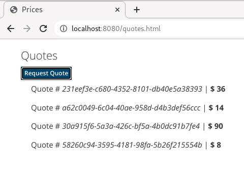

# microservices-msg

Example project that leverages a quarkus template extension mechanism for microservices.

- https://github.com/eformat/quarkus-microservice-template-messaging

The template can be managed, and includes any shared code and dependencies.

In this example, it exposes:

- kafka (using quarkus dev services)

## Prerequisites

We need the template extension:

```xml
        <dependency>
            <groupId>org.acme.microservice</groupId>
            <artifactId>quarkus-microservice-messaging-deployment</artifactId>
            <version>1.0.0-SNAPSHOT</version>
        </dependency>
```

You can:

[Build and Install the extension locally FIRST](https://github.com/eformat/quarkus-microservice-template-messaging)

[If using podman, make sure to set DOCKER_HOST correctly](https://quarkus.io/blog/quarkus-devservices-testcontainers-podman) for quarkus dev services container.

## Run It

Run the example. This will fire up a redpanda kafka container using dev services, run a producer and consumer (request-reply):

```bash
mvn -f quote-producer quarkus:dev
mvn -f quote-consumer quarkus:dev
```

Test it out:

- http://localhost:8080/quotes.html


